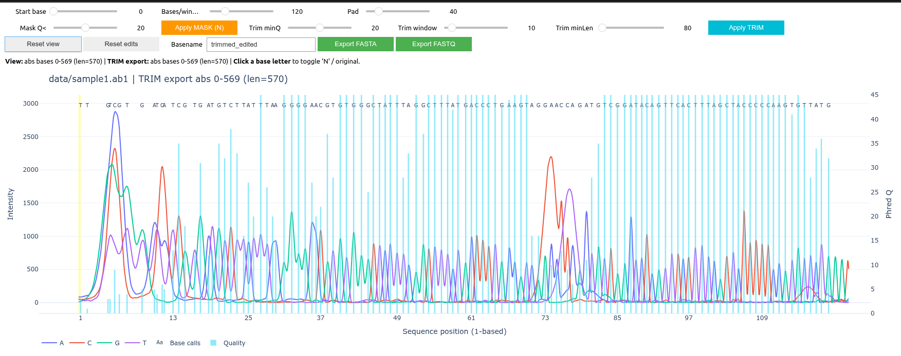
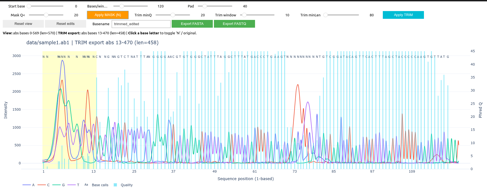

<h1>
  
  AB1 Chromatogram Viewer and Editor
</h1>

An interactive **Jupyter Notebook–based tool** for visualizing, editing, trimming,
and exporting **Sanger sequencing chromatograms (`.ab1`)** using **Biopython**
and **Plotly**.

The application provides a chromatogram-style view of raw trace signals,
base calls, and per-base quality scores, allowing manual inspection and curation
of sequencing reads prior to downstream analyses.

[](https://colab.research.google.com/github/sgvallve/Ab1_Viewer/blob/main/Ab1_Chromatogram_viewer_Collab.ipynb)
---


## Features

- Read ABI **`.ab1` Sanger sequencing files**
- Automatic assignment of ABI trace channels to **A / C / G / T**
- Interactive chromatogram visualization:
  - Colored traces for each nucleotide
  - Base calls displayed above the peaks
  - Per-base quality bars
- Mouse hover information:
  - Base identity and Phred quality
  - Trace intensity and nucleotide channel
- Manual sequence editing:
  - Click a base to toggle it to `N` and back
- Quality-based processing:
  - End trimming using a sliding-window mean of Phred scores
  - Masking of low-quality bases (`Q < threshold → N`)
- Export curated reads:
  - **FASTA** (sequence only)
  - **FASTQ** (sequence + quality scores)

---

## Screenshot Examples

### Chromatogram View



### Trimmed and Edited Read



---

## Requirements

### Python
- Python **≥ 3.9**

### Python packages

```text
biopython
numpy
plotly
ipywidgets
anywidget
```

Install dependencies with:

```bash
pip install biopython numpy plotly ipywidgets anywidget
```

---

## Repository Structure

```text
ab1-chromatogram-viewer/
├── ab1_chromatogram_viewer.ipynb
├── README.md
├── data/
│   └── example.ab1
├── screenshots/
│   ├── chromatogram_view.png
│   └── trimmed_view.png
├── viewer_out/
│   └── exported FASTA and FASTQ files
└── .gitignore
```

---

## Usage

### 1. Open the notebook

Open Jupyter and load:

```
ab1_chromatogram_viewer.ipynb
```

### 2. Set the input file

In the first code cell:

```python
AB1_PATH = "data/example.ab1"
```

### 3. Run the notebook

Run all cells:

The interactive chromatogram viewer will appear below the final cell.

---

## Interactive Controls

### Navigation
- **Start base** – first base shown in the current window
- **Bases/window** – number of bases displayed
- **Pad** – extra signal margin around the visible base range

### Quality processing
- **Trim minQ** – minimum Phred score for trimming
- **Trim window** – window size (bases) for mean-quality trimming
- **Trim minLen** – minimum allowed length after trimming
- **Mask Q <** – quality threshold for masking bases to `N`

### Actions
- **Apply TRIM** – trims low-quality ends only
- **Apply MASK (N)** – masks low-quality bases inside the current view
- **Reset view** – return to the full read
- **Reset edits** – restore original base calls
- **Export FASTA / FASTQ** – save the current trimmed and edited sequence

---

## Output

All exported files are written to:

```
viewer_out/
```

### FASTA
- Curated nucleotide sequence
- Masked bases appear as `N`
- No quality information stored

### FASTQ
- Curated sequence and Phred qualities
- Masked bases retain original quality scores

---

## Coordinate System

- Base numbering is **1-based**
- X-axis labels correspond to **sequence positions**
- Raw trace indices are used internally for signal rendering

---

## Limitations

- Edits do not modify the original `.ab1` file
- Intended for interactive use, not high-throughput batch processing
- The complementary / reverse sequence could be calculated

---

## License

Add your preferred open-source license (e.g. MIT, BSD, GPL) in a `LICENSE` file.

---

## Acknowledgements

- **Biopython** for ABI parsing and sequence handling
- **Plotly** and **ipywidgets** for interactive visualization in Jupyter
